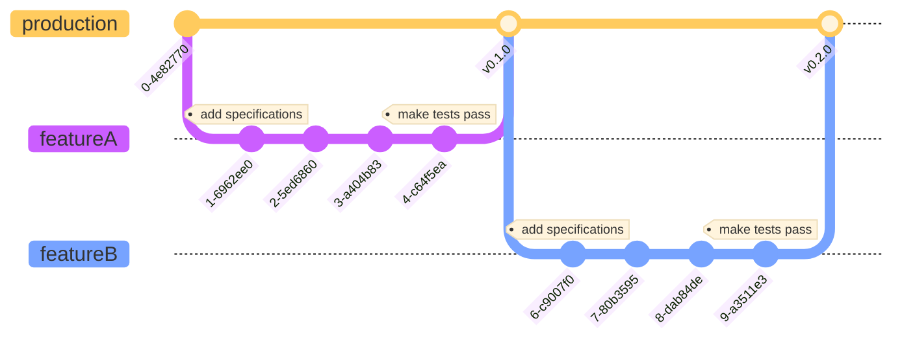

# Automated Testing

## Overview

A short introduction to testing, test automation and Continous Integration.

## Content

- [Run this locally](#types-of-tests-explained)
- [Types of Tests Explained](#types-of-tests-explained)
  - [Unit Testing](#unit-testing)
  - [Integration Testing](#integration-testing)
  - [End-to-End Testing](#end-to-end-e2e-testing)
- [Strategies for Effective Testing](#strategies-for-effective-testing)
  - [Arrange, Act, Assert](#arrange-act-assert-aaa)
- [Continuous Integration](#continuous-integration-ci)
- [Essential Resources](#essential-resources)
- [Conclusion](#conclusion)
- [Further Reading](#further-reading-advanced-and-specialized-testing)
- [Links](#links)

## Run this locally

0. **Prerequisites**

- [NodeJS](https://nodejs.org/) installed

1. Clone this repository `git clone https://github.com/LarsGJobloop/kodeloftet-modul-d-27-02-24-automated-testing`
2. Run the automated tests `npm run test`

## Types of Tests Explained

Testing is a critical part of software development that ensures your code behaves as expected. Let's dive into the different types of tests you'll encounter:

### Unit Testing

Unit tests are the foundation of a solid test suite, focusing on individual functions or components. These tests validate that your code performs correctly under various conditions, including handling inputs, processing data, and managing errors. By isolating each part of your application, you can quickly identify and fix bugs.

#### Tools:

- [Vitest]
- [Jest]

### Integration Testing

Integration testing examines how multiple units work together. For example, testing the interaction between a button component and the API it calls upon click ensures they integrate seamlessly. These tests are crucial for catching issues that unit tests might miss, such as problems with data flow or API integration.

#### Tools:

- [Testing Library React] with [Vitest] (or [Jest]).

### End-to-End (E2E) Testing

E2E testing simulates real user scenarios to ensure the application performs as designed from start to finish. It involves automating interactions with your application in a browser environment to test critical user flows, such as signing up or completing a transaction.

#### Tools:

- [Cypress]
- [Playwright]
- [Selenium]

## Strategies for Effective Testing

### [Arrange, Act, Assert] (AAA)

The AAA pattern is a clear and structured approach to writing tests:

- **Arrange:** Set up the conditions for your test.
- **Act:** Execute the function or component you're testing.
- **Assert:** Verify the outcome matches your expectations.

Here's a simple example to demonstrate the AAA pattern in a unit test:

```javascript
// Arrange
const handleClick = vi.fn(); // a utility type where we can check certain aspects
const { container } = render(
  <Button onClick={handleClick}>Clickable Button</Button>
);

// Act
fireEvent.click(container.firstChild);

// Assert
expect(handleClick).toHaveBeenCalledOnce();
```

## Continuous Integration (CI)

Integrating testing into your CI pipeline ensures tests are automatically run with every commit, helping to catch and fix issues early. Tools like [GitHub Actions], [Circle CI], and [Jenkins] can automate this process, running your test suite on various environments and configurations.

To achieve this though, we need to increase some of the complexities when it comes to what is stored on GitHub. Specifically we will have two branches we work with from now, one for the deployed page (production) and another with the pending changes (development). This will ensure we don't include any new changes to the deployed page that breaks existing functionality defined by our test suite.

The resulting workflow might look something like this:



This means that we are never changing what is in production directly. We are using Pull Requests (GitHub style) / Merge Requests from branches where we are developing new Features and only include new changes that are vetted by our automated systems, and potentially other team members.

## Essential Resources

- **[Vitest Testing Library](https://vitest.dev/):**

  A modern testing library that offers a seamless testing experience for JavaScript frameworks. [Vitest]

- **[Testing Library for React](https://testing-library.com/):**

  Simplifies testing of React components by focusing on their behavior rather than their implementation. [React Testing Library]

- **[Mock Service Worker](https://mswjs.io/):**

  Allows you to intercept and mock HTTP requests to test your application under different server conditions. [Mock Service Worker](https://mswjs.io/) (MSW).

- **[Playwright](https://playwright.dev/):**

  A powerful tool for automating browser tests, supporting multiple browsers out of the box. [Playwright]

- **[Arrange Act Assert Examples](https://automationpanda.com/2020/07/07/arrange-act-assert-a-pattern-for-writing-good-tests/):**

  For more detailed examples of the AAA pattern in action. [AAA Examples](https://chat.openai.com/share/c906a0d8-c8f4-4d18-b69e-2d3ada5ee9a4)

## Conclusion

Becomming skilled in automated software testing allows you to enhance the reliability and stability of software applications. The extent of testing varies significantly across the industry, from minimal manual checks to comprehensive automated tests covering every aspect of the codebase.

Considerations for determining the appropriate level of testing include:

- **Dependency and Impact**:

  How critical is your software to other systems? Core libraries, such as React or NodeJS, necessitate extensive testing due to their widespread use. In contrast, personal projects with a limited scope may require minimal testing.

- **Regulatory Requirements**:

  Sectors with stringent regulations, like finance, demand thorough testing to ensure compliance and functionality. For projects without such external pressures, a lighter approach may suffice.

The balance of testing should align with the project's complexity, potential risk, and regulatory environment. Whether developing a foundational library or a small-scale personal project, thoughtful testing is crucial to ensuring software performs as intended while meeting the necessary standards.

In essence, tailor your testing strategy to reflect the significance and scope of your project, considering both its technical and regulatory contexts. This approach ensures not only the stability and reliability of your software but also its compliance with relevant standards and expectations.

## Further Reading:<br>Advanced and Specialized Testing

While focusing on Unit, Integration, and E2E tests is crucial, there are more testing types and strategies that can enhance your application's quality further. These include:

- Accessibility Testing

  Ensuring your application is accessible to all users. Tools like Axe can automate this process.

- Performance Testing

  Important for optimizing user experience. Lighthouse is a great tool for assessing web performance.

- Visual Regression Testing

  Helps catch unintended visual changes. Tools like Percy integrate with CI to automate visual comparisons.

- Mocking and Service Virtualization

  For simulating APIs and external services during testing. Mock Service Worker is an excellent tool for front-end developers.

## Links

- Misc
  - [Arrange, Act, Assert]
- Unit Testing/Integration Testing (Minimal)
  - **[Vitest] - Recommended**
  - **[Testing Library React] - for React Applications**
  - [Testing Library] - For other frontend frameworks
  - [Jest] - for JavaScript apps/packages that does not use [Vite]
- Unit Testing/Integration Testing Intermediate
  - **[Mock Service Worker] - Reccomended**
- End-to-End Testing, User & Browser Simulation
  - **[Playwright] - Reccomended**
  - [Cypress]
  - [Selenium]
- Continous Integration
  - **[GitHub Actions] - Reccomended**
  - [Circle CI]
  - [Jenkins]
- Visual Regression Testing
  - **[BackstopJS] - Reccomended**
  - [Percy]
-

[Vite]: https://vitejs.dev/
[Vitest]: https://vitest.dev/
[Jest]: https://jestjs.io/
[Testing Library React]: https://testing-library.com/docs/react-testing-library/intro/
[Testing Library]: https://testing-library.com/
[Cypress]: https://www.cypress.io/
[Playwright]: https://playwright.dev/
[Mock Service Worker]: https://mswjs.io/
[Selenium]: https://www.selenium.dev/
[Percy]: https://percy.io/
[BackstopJS]: https://garris.github.io/BackstopJS/
[Arrange, Act, Assert]: https://automationpanda.com/2020/07/07/arrange-act-assert-a-pattern-for-writing-good-tests/
[GitHub Actions]: https://docs.github.com/en/actions
[Circle CI]: https://circleci.com/
[Jenkins]: https://www.jenkins.io/
[Google Lighthouse]: https://github.com/GoogleChrome/lighthouse
----------------------------------------------------------------------------------------------
# Tester/Spesifikasjoner

Tester er noe du har gjort gjennom all utviklingen hittil. Det enkleste er at du har skrevet noe kode og så sjekket i nettleseren at resultatet er som du forventet. Automatiske tester er i essens det samme, men her skriver vi kode som gjør denne jobben for oss. Noe å notere seg er at det er veldig stor forskjell mellom bedrifter her på hvor mye som testes og om det i det hele tatt utføres automatiske tester i det hele tatt.

En noe grov oversikt:

- Hvor mange lover og reguleringer må systemet oppfylle?
Finans, Helse og industri sektoren har mange lovpålagte krav de må tilfredstille som leder til mer testing
- Hvor mange er avhengig av at systemet fungerer?
Mange er avhengig av React, mens få er avhengig av dine private prosjekter. Mye testing for React, mindre testing for dine.

Vi deler tester inn i litt forskjellige typer avhengig av hva vi skal teste. De mest brukte:
- **Unit Tester**
Minste og mest vanlige typen for tester. Tester at funksjoner returnere spesifikke verdier når de kjøres med spesifikke variabler
- **Integrasjons Tester**
Det er ett stort spenn her. Tester at individuelle komponenter fungerer sammen. Størrelsen på komponentene spenner fra sett med funksjoner til større samlinger med systemer.
- **Ende til Ende Tester**
Øverste laget av tester der vi tester funksjoner til hele systemer og at det fungerer som det er designet. For nettsider/applikasjoner så vil dette bety at vi går igjennom en prossess som f.eks registrerings prosessen og sørger for at den fungerer. For automatisering så vil dette bety at vi starter en hel nettleser og har et program som går igjennom alle disse stegene for oss. Dette er komplisert og dyrt, så vi holder disse noe begrenset og til funksjonalitet som er kritisk for at systemet vårt fungerer.

## Kontinuerlig Integrasjon

I forbindelses med automatisering av tester så har vi det som kalles Continuous Integration (CI) som betyr at vi kjører igjennom det settet med automatiske tester vi har definert før nye endringer til kodebasen innføres. Dette gjør at vi har en større tillit til at systemet vårt fortsetter å fungerer som designet selv etter nye endringer er inkludert.

Dette kan gjøres gjennom GitHub Actions, hvor vi setter opp at noe skal skje når nye hendelser inntreffer i GitHub repoet vårt.
De er ikke veldig komplekse, men kan være noe knotete å sette opp. GitHub har en markedsplass for forskjellige ferdig oppsett som jeg anbefaler å hente ting i fra til å begynne med.

Repoet som er linket har en veldig enkel pipeline som kjører tester på alle Pull Requests som opprettes mot main. Noe som gir deg en indikasjon på om endringen er klar til å lanseres til brukerne (lansering av en ny versjon). Dette forutsetter at de automatiske testene som er skrevet dekker det som er viktig av funksjonalitet.


## Lenker
### **Testing av JavaScript funksjoner**
- **Vitest** - https://vitest.dev/
 <br> Testing Rammeverk for testing av JavaScript, med integrasjoner mot Vite
### **Biblioteker for testing av React Applikasjoner**
- **@testing-library/react** - https://testing-library.com/docs/react-testing-library/intro/
  <br>For å teste React komponenter
 - **happy-dom**
  <br>For å kunne teste mot et lettvektig DOM
### **Ende til Ende Testing av nettsider/applikasjoner- Cypress** 
Her er nettlesere som kan programmeres til å gå igjennom nettsiden din for å teste bruker reiser som du har definert.
 <br> Registrere ny bruker, bestille varer, med mer.

## Merknad:

Litt kort sagt om tester er at de krever planlegging før en settter de opp, et annet navn som kan bites merke i er ordet spesifikasjon.Vet du ikke hva programmet eller funksjonen din skal gjøre, så kan en heller ikke skrive tester for at de gjør det du ikke vet.

Dette gjør at for å kunne skrive automatiserte tester så må du ha et klart formulert svar, eller krav, som systemet ditt skal oppfylle.
